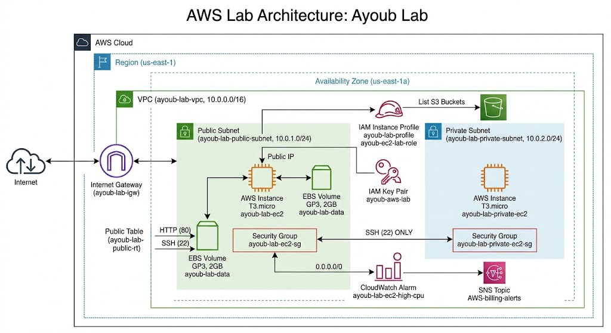

# AWS Infrastructure environment

A hands-on AWS infrastructure environment built with **Terraform** to understand how cloud infrastructure actually works underneath the abstractions.

This project started as a simple EC2 experiment and gradually became a small infrastructure environment where I could work with networking, IAM, storage, monitoring, alerting, failure scenarios, and infrastructure as code.

The goal was not to deploy a huge architecture.

The goal was to **build it, break it, understand why it broke, fix it, and document what I learned.**

---

## What I Built

The current environment runs in **AWS `us-east-1` (N. Virginia)**.

The infrastructure contains:

* A VPC
* A public subnet
* A private subnet
* An Internet Gateway
* Public and private route behavior
* Two EC2 instances
* Security groups
* IAM role and instance profile
* An S3 IAM permission test
* An SSH key pair
* A 2 GiB GP3 EBS volume
* XFS filesystem mounted on `/data`
* CloudWatch EC2 monitoring
* A CloudWatch CPU alarm
* SNS notifications
* Terraform-managed infrastructure
* Several deliberate failure and recovery experiments

This is a **learning and engineering environment**, not a production architecture.

---

## Architecture

### Network layout

| Component         | CIDR / ID     |
| ----------------- | ------------- |
| VPC               | `10.0.0.0/16` |
| Public subnet     | `10.0.1.0/24` |
| Private subnet    | `10.0.2.0/24` |
| Public EC2        | `10.0.1.231`  |
| Private EC2       | `10.0.2.84`   |
| Region            | `us-east-1`   |
| Availability Zone | `us-east-1a`  |

The private subnet intentionally has **no NAT Gateway**.

That means the private EC2 instance can communicate with resources inside the VPC, but it does not have a path to the public Internet.

This was intentional because the objective was to understand the networking behavior without introducing unnecessary AWS costs.

---

# 1. VPC and Networking

The first part of the lab was understanding the difference between a public and private subnet.

The VPC uses:

```text
10.0.0.0/16
```

with two subnets:

```text
Public:
10.0.1.0/24

Private:
10.0.2.0/24
```

The public subnet has:

```text
0.0.0.0/0 → Internet Gateway
```

while both subnets have the automatic VPC local route:

```text
10.0.0.0/16 → local
```

This local route is what allows the public and private subnets to communicate with each other.

---

## Public subnet

The public subnet contains the main EC2 instance.

It has:

* A private IP
* A public IP
* A route to the Internet Gateway
* A security group allowing the required traffic

The EC2 instance was used as the main machine for SSH access, experiments, monitoring and storage testing.

---

## Private subnet

The private subnet contains another EC2 instance.

It has:

* Private IP only
* No public IP
* No direct Internet Gateway route
* Connectivity to the VPC through the local route

The private instance was useful for proving the difference between:

```text
VPC connectivity
```

and:

```text
Internet connectivity
```

For example, from the private instance:

```bash
curl -I https://www.google.com
```

timed out.

That was expected.

The instance had a default route inside its operating system, but the AWS route table did not provide a path from the private subnet to the Internet.

---

# 2. Internet Gateway

The public route table contains:

```text
Destination: 0.0.0.0/0
Target: Internet Gateway
```

This provides the path:

```text
EC2
 ↓
Public Subnet
 ↓
Route Table
 ↓
Internet Gateway
 ↓
Internet
```

I deliberately deleted this route during the lab:

```bash
aws ec2 delete-route \
  --route-table-id <route-table-id> \
  --destination-cidr-block 0.0.0.0/0
```

After removing the route, SSH access to the public EC2 instance stopped working.

I then restored it:

```bash
aws ec2 create-route \
  --route-table-id <route-table-id> \
  --destination-cidr-block 0.0.0.0/0 \
  --gateway-id <internet-gateway-id>
```

SSH access returned.

This was one of the most useful experiments in the lab because it demonstrated that a working EC2 instance is not enough.

The **network path matters**.

---

# 3. EC2

Two EC2 instances were created.

### Public EC2

```text
Instance type: t3.micro
OS: Amazon Linux 2023
Subnet: 10.0.1.0/24
Private IP: 10.0.1.231
Public IP: Dynamic
```

### Private EC2

```text
Instance type: t3.micro
Subnet: 10.0.2.0/24
Private IP: 10.0.2.84
Public IP: None
```

The public IP can change after stopping and starting the instance.

This was another useful AWS behavior to observe.

Instead of treating the public IP as permanent infrastructure, Terraform outputs and AWS resource attributes should be used to discover the current address.

For example:

```bash
terraform output -raw ec2_public_ip
```

---

# 4. Security Groups

Security groups were used to control traffic to the EC2 instances.

The public EC2 security group was used for the required access such as SSH and HTTP during testing.

The private EC2 had its own security group.

The important lesson here was that networking is not controlled by a single component.

Traffic can be affected by:

```text
Subnet
↓
Route table
↓
Internet Gateway / other AWS networking
↓
Security Group
↓
Operating system
```

A failure at any relevant layer can produce a different symptom.

---

# 5. SSH Access to the Private EC2

The private EC2 did not have a public IP, so it could not be accessed directly from the Internet.

Instead, the public EC2 was used as a jump/bastion host.

The connection path was:

```text
Laptop
   |
   | SSH
   v
Public EC2
   |
   | SSH over VPC local routing
   v
Private EC2
```

SSH agent forwarding was used so that the private key did not need to be copied onto the public EC2 instance.

From the laptop:

```bash
ssh-add ~/.ssh/ayoub-aws-lab
```

Then:

```bash
ssh -A -i ~/.ssh/ayoub-aws-lab ec2-user@<public-ip>
```

From the public EC2:

```bash
ssh ec2-user@10.0.2.84
```

The connection succeeded.

This demonstrated an important concept:

> The private instance does not need a public IP to communicate with another instance in the same VPC.

The VPC local route handles the internal traffic.

---

# 6. IAM

The public EC2 instance was given an IAM role through an instance profile.

The role uses an EC2 trust relationship:

```text
EC2
 ↓
Instance Profile
 ↓
IAM Role
 ↓
Permissions
```

An inline policy was created for the lab that allowed:

```text
s3:ListAllMyBuckets
```

The purpose was to understand how an application or EC2 instance can obtain AWS permissions without storing long-lived AWS access keys on the machine.

This is an important difference between:

```text
Hard-coded AWS credentials
```

and:

```text
IAM role → temporary credentials
```

The second approach is the normal direction to take for AWS workloads.

---

# 7. EBS Storage

A separate EBS volume was created:

```text
Size: 2 GiB
Type: GP3
Availability Zone: us-east-1a
```

The volume was attached to the public EC2 instance.

Inside Linux, the device appeared as an NVMe device.

It was formatted using XFS:

```bash
sudo mkfs -t xfs /dev/nvme1n1
```

A mount point was created:

```bash
sudo mkdir /data
```

and the volume was mounted:

```bash
sudo mount /dev/nvme1n1 /data
```

A test file was created:

```bash
echo "Hello from Ayoub's EBS volume" | sudo tee /data/test.txt
```

The volume was then unmounted and detached.

After reattaching it, the filesystem was mounted again and the file was still there.

This demonstrated that the data belongs to the **EBS volume**, not to the lifecycle of the EC2 instance itself.

---

# 8. CloudWatch Monitoring

CloudWatch was used to monitor the EC2 instance.

The lab explored standard EC2 metrics such as:

* CPU utilization
* Network traffic
* Network packets
* EBS read/write operations
* EBS read/write bytes
* Status checks
* CPU credit usage
* CPU credit balance

For example:

```bash
aws cloudwatch list-metrics \
  --namespace AWS/EC2 \
  --dimensions Name=InstanceId,Value=<instance-id>
```

CPU utilization was queried with:

```bash
aws cloudwatch get-metric-statistics \
  --namespace AWS/EC2 \
  --metric-name CPUUtilization \
  --dimensions Name=InstanceId,Value=<instance-id> \
  --statistics Average \
  --period 300 \
  --start-time "$(date -u -d '30 minutes ago' +%Y-%m-%dT%H:%M:%SZ)" \
  --end-time "$(date -u +%Y-%m-%dT%H:%M:%SZ)"
```

The `300` second period means that CloudWatch was returning a five-minute aggregation.

---

# 9. CPU Incident

Instead of simply watching a dashboard, I deliberately created a CPU load.

On the EC2 instance:

```bash
yes > /dev/null &
```

This generated CPU activity.

CloudWatch subsequently showed increased CPU utilization.

The incident was investigated from the operating system using commands such as:

```bash
uptime
```

```bash
top
```

```bash
ps aux --sort=-%cpu
```

```bash
free -h
```

and:

```bash
sudo journalctl -n 50 --no-pager
```

The process responsible for the CPU usage could then be identified and terminated:

```bash
pkill yes
```

CloudWatch was checked again to verify that CPU utilization returned toward normal.

The basic incident workflow was:

```text
Alert
 ↓
Measure
 ↓
Inspect the host
 ↓
Find the process
 ↓
Remediate
 ↓
Verify recovery
```

This was more useful than simply learning what a CloudWatch alarm is.

---

# 10. CloudWatch Alarm

A CloudWatch alarm was configured for high CPU utilization.

The alarm:

```text
Name:
ayoub-lab-ec2-high-cpu
```

uses:

```text
Metric:
CPUUtilization

Statistic:
Average

Period:
300 seconds

Threshold:
20%

Condition:
GreaterThanThreshold
```

The alarm can move through states such as:

```text
INSUFFICIENT_DATA
        ↓
       OK
        ↓
      ALARM
        ↓
       OK
```

The CPU stress experiment was used to trigger the alarm and then verify recovery after the process was terminated.

---

# 11. SNS Notifications

SNS was used as the notification destination for the CloudWatch alarm.

The flow is:

```text
EC2
 ↓
CloudWatch Metric
 ↓
CloudWatch Alarm
 ↓
SNS
 ↓
Notification
```

This creates a simple foundation for event-driven infrastructure monitoring.

---

# 12. Terraform

The infrastructure is managed using Terraform rather than being created manually through the AWS Console.

This includes resources such as:

* VPC
* Subnets
* Route tables
* Internet Gateway
* Security groups
* EC2 instances
* IAM role
* IAM instance profile
* IAM policy
* SSH key pair
* EBS volume
* EBS attachment
* CloudWatch alarm

The general workflow is:

```bash
terraform init
```

```bash
terraform validate
```

```bash
terraform plan
```

```bash
terraform apply
```

and eventually:

```bash
terraform destroy
```

The important part is not simply knowing Terraform syntax.

The goal is to understand the relationship between:

```text
Terraform configuration
        ↓
Terraform state
        ↓
AWS resources
```

---

# 13. AMI Pinning

During the lab, I also learned why blindly using:

```text
most_recent = true
```

can be problematic for reproducibility.

The EC2 AMI was therefore pinned to a specific AMI ID.

Example:

```hcl
variable "ami_id" {
  description = "Pinned Amazon Linux AMI for the lab"
  type        = string

  default = "ami-0ac62d2d72afdce51"
}
```

The purpose is to make the infrastructure predictable.

If the AMI changes automatically, Terraform may see a different resource configuration and attempt to replace the instance.

For a controlled lab, explicitly pinning the AMI makes behavior easier to understand.

---

# 14. Failure Experiments

This lab was not built only to make everything work.

Several things were intentionally broken.

### Deleted Internet route

The public subnet's default route was removed.

Result:

```text
Internet connectivity → broken
SSH → broken
```

Restoring the route fixed the problem.

---

### Private instance Internet access

The private EC2 was tested with:

```bash
curl -I https://www.google.com
```

Result:

```text
Timeout
```

This was expected because there is no NAT Gateway.

---

### Private EC2 access

The private EC2 was accessed through the public EC2.

Result:

```text
Laptop
 ↓
Public EC2
 ↓
Private EC2
```

This worked because both instances are inside the same VPC and the VPC local route allows internal communication.

---

### EBS detach and reattach

The EBS volume was detached and attached again.

The data remained available.

This demonstrated the difference between compute lifecycle and persistent block storage.

---

### CPU stress

A CPU-consuming process was deliberately started.

CloudWatch detected the increased utilization.

The process was identified and terminated.

The alarm returned to the normal state.

---

# 15. Useful Linux Commands

Some of the commands used during the experiments:

### Network interfaces

```bash
ip addr
```

### Routing table

```bash
ip route
```

### Determine the route to a destination

```bash
ip route get 8.8.8.8
```

### Check CPU and processes

```bash
top
```

```bash
ps aux --sort=-%cpu
```

### Memory

```bash
free -h
```

### Disk

```bash
df -h
```

### System uptime/load

```bash
uptime
```

### System logs

```bash
sudo journalctl -n 50 --no-pager
```

### Kernel logs

```bash
sudo journalctl -k -n 30 --no-pager
```

### SSH logs

```bash
sudo journalctl -u sshd --no-pager -n 30
```

These commands became particularly useful when debugging incidents instead of relying only on the AWS console.

---

# 16. What I Learned

The biggest part of this project was not the number of AWS resources.

It was understanding how the pieces interact.

### Networking

A public IP alone does not make an instance reachable.

You need the correct combination of:

```text
Public IP
+
Subnet
+
Route table
+
Internet Gateway
+
Security Group
+
Operating system
```

---

### Private networking

A private instance can communicate with other resources in the VPC without having a public IP.

The VPC's local route handles that communication.

Internet access is a separate problem.

---

### Storage

An EC2 instance and an EBS volume have different lifecycles.

The instance provides compute.

The EBS volume provides persistent block storage.

---

### IAM

Applications should receive permissions through IAM roles rather than storing long-lived AWS credentials on the machine.

---

### Monitoring

Metrics tell you **what the system is doing**.

Logs help explain **what happened**.

For example:

```text
CloudWatch
    ↓
CPU is high
```

then:

```text
Linux
    ↓
top / ps / journalctl
    ↓
Find the process
```

Monitoring becomes much more useful when combined with investigation.

---

### Infrastructure as Code

Terraform makes infrastructure reproducible and reviewable.

But Terraform does not replace understanding AWS.

If the underlying AWS behavior is not understood, Terraform can simply automate confusion.

---

# 17. Cost Awareness

This lab was deliberately kept small.

The main decisions were:

* `t3.micro` instances
* Small EBS volume
* One Availability Zone
* No NAT Gateway
* No unnecessary load balancers
* No RDS
* No large compute resources
* Standard CloudWatch metrics
* EC2 instances stopped when they were not needed

The goal was to learn AWS without turning a learning environment into an unnecessary monthly bill.

---

# 18. Security Notes

This repository should **never contain**:

* Private SSH keys
* AWS access keys
* AWS secret keys
* Passwords
* `.env` files containing credentials
* Terraform state containing sensitive information
* Personal AWS account information

The private key used by the lab remains outside the repository.

A `.gitignore` should include sensitive files such as:

```gitignore
.terraform/
*.tfstate
*.tfstate.*
*.tfvars
*.tfvars.json
.env
.env.*
*.pem
```

Depending on the repository structure, additional Terraform-generated files should also be ignored.

---

# 19. Project Structure

The exact Terraform files may evolve as the lab grows, but the project follows the general idea of separating infrastructure configuration into manageable components.

For example:

```text
.
├── README.md
├── main.tf
├── variables.tf
├── outputs.tf
├── providers.tf
├── terraform.tfvars
└── ...
```

The important thing is that the infrastructure can be recreated from code rather than depending on a sequence of manual console clicks.

---

# 20. Reproducing the Lab

### Requirements

You need:

* An AWS account
* Terraform
* AWS CLI
* SSH
* An AWS IAM identity with sufficient permissions

Configure AWS credentials locally using your preferred secure method.

Verify the AWS CLI:

```bash
aws sts get-caller-identity
```

Then initialize Terraform:

```bash
terraform init
```

Validate:

```bash
terraform validate
```

Review the plan:

```bash
terraform plan
```

Apply:

```bash
terraform apply
```

After deployment, use Terraform outputs to retrieve values such as the current EC2 public IP.

---

# 21. Cleanup

When the lab is no longer needed, destroy the infrastructure:

```bash
terraform destroy
```

Before doing this, make sure there is no data on the EBS volume that needs to be kept.

The purpose of destroying unused resources is both security and cost control.

---

# 22. What Is Not Included Yet

This repository represents the infrastructure that was actually built and tested.

The following are **future work**, not currently deployed components:

* Application Load Balancer
* Auto Scaling
* RDS
* NAT Gateway
* Multi-AZ architecture
* Kubernetes
* Prometheus
* Grafana
* CloudWatch Agent
* Centralized application logging
* Distributed tracing
* Service mesh
* Production-grade CI/CD
* Advanced IAM policies
* Full production security architecture

These will be explored in later stages rather than being presented as already completed.

---

# 23. Next Steps

The next stage is to move from a basic AWS lab toward more production-oriented infrastructure engineering.

Planned areas include:

```text
Production Terraform
        ↓
AWS Architecture
        ↓
Linux & Systems Engineering
        ↓
Production Kubernetes
        ↓
Kubernetes Networking
        ↓
Observability
        ↓
Go for Infrastructure
        ↓
CI/CD & Platform Engineering
        ↓
Production-grade project
```

The intention is to gradually move from:

```text
"I know how to deploy this."
```

to:

```text
"I understand why this works,
I know how it fails,
I can debug it,
and I can automate it."
```

---

# 24. Final Notes

This project is intentionally simple.

There is no attempt to make a small learning lab look like a massive production platform.

Instead, the focus was on understanding the fundamentals properly:

* How packets move
* How AWS routing works
* What makes a subnet public or private
* How EC2 communicates with other resources
* How IAM roles work
* How persistent storage behaves
* How monitoring detects problems
* How an alert becomes an incident
* How to investigate a Linux host
* How Terraform represents infrastructure
* How infrastructure changes when something is deliberately broken

The most valuable part of the project was the experimentation.

I didn't just deploy the infrastructure.

I **broke it on purpose, investigated the failure, fixed it, and verified the recovery.**

That is the mindset I want to carry into larger infrastructure and SRE projects.

---

## Author

**Ayoub Nasraoui**

Computer Science / DevOps & SRE

Interests:

* Infrastructure Engineering
* Site Reliability Engineering
* AWS
* Terraform
* Kubernetes
* Linux
* Observability
* Automation
* Cloud Architecture

> Build → Break → Debug → Automate → Document → Rebuild

---
